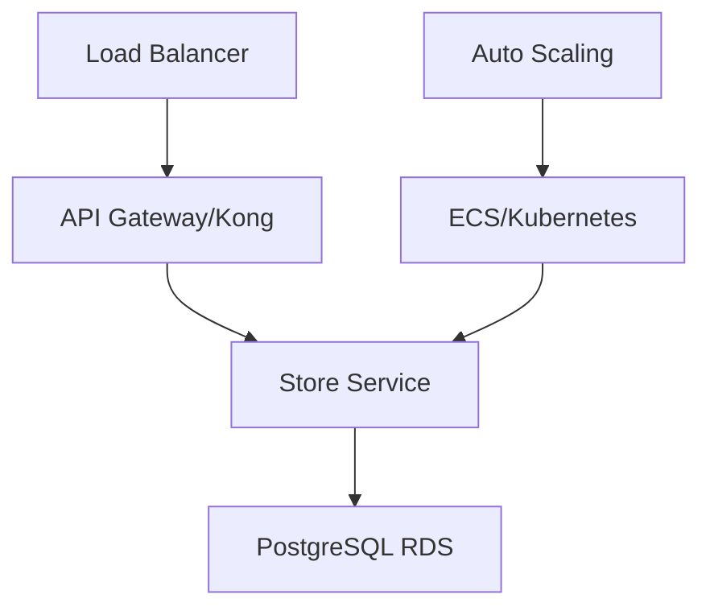

# Microservice Store

[](https://sonarcloud.io/summary/new_code?id=YOUR_SONAR_PROJECT_KEY)
[](https://sonarcloud.io/summary/new_code?id=YOUR_SONAR_PROJECT_KEY)

## 📋 Overview

Microservice responsible for **store/establishment management** built with **Clean Architecture** and **NestJS**. This service is part of the Tech Challenge microservices architecture and handles all domain logic related to store operations, configurations, and management.

## 🚀 Features

### 🏪 Store Management

- Store registration and authentication
- Store profile management
- Business hours configuration
- Location and contact information
- Multi-store support

### ⚙️ Store Configuration

- Operational settings
- Business rules customization
- Feature toggles
- Regional settings

### 📊 Store Analytics

- Operational metrics
- Performance tracking
- Store status monitoring

## 📊 Quality Metrics

- **Coverage**: 93.87% (90 tests)
- **Quality**: Integrated with SonarCloud
- **CI/CD**: Automated pipeline with GitHub Actions
- **Architecture**: Clean Architecture with isolated domains

## 🏗️ Architecture

### Technology Stack

- **Framework**: NestJS 10.x with TypeScript 5.9.3
- **Architecture**: Clean Architecture (Hexagonal)
- **Database**: PostgreSQL with TypeORM
- **Container**: Docker
- **Orchestration**: AWS ECS / Terraform
- **Testing**: Jest (93.87% coverage)
- **Code Quality**: SonarCloud + ESLint
- **CI/CD**: GitHub Actions
- **API Gateway**: Kong Gateway (separate infrastructure)

### Architecture Diagram



**Infrastructure Components:**

- **Container Orchestration**: AWS ECS with Fargate
- **Database**: PostgreSQL (RDS)
- **Auto Scaling**: CPU/Memory based
- **Load Balancer**: Application Load Balancer (ALB)
- **API Gateway**: Kong Gateway for routing
- **CI/CD**: GitHub Actions with automated deployment
- **Monitoring**: SonarCloud + CloudWatch

### Domain Separation

#### 🏪 Store Domain

- Store entity management
- Authentication and authorization
- Configuration management
- Profile updates
- Multi-tenancy support

## 📚 API Documentation

### 🏥 Health Endpoint

```http
GET /health                     # Health check
```

### 🏪 Store Endpoints

```http
POST   /stores                  # Register new store
GET    /stores                  # List all stores
GET    /stores/:id              # Get store by ID
PUT    /stores/:id              # Update store
DELETE /stores/:id              # Delete store
POST   /stores/login            # Store authentication
```

**Request Example (POST /stores)**:

```json
{
  "name": "My Restaurant",
  "cnpj": "12345678000190",
  "email": "contact@myrestaurant.com",
  "phone": "1199999999",
  "address": {
    "street": "Main St",
    "number": "123",
    "city": "São Paulo",
    "state": "SP",
    "zipCode": "01234567"
  }
}
```

### ⚙️ Configuration Endpoints

```http
GET    /stores/:id/config       # Get store configuration
PUT    /stores/:id/config       # Update configuration
```

### 📊 Analytics Endpoints

```http
GET    /stores/:id/metrics      # Get store metrics
GET    /stores/:id/status       # Get operational status
```

### 🔐 Authentication

Store endpoints require authentication via:

- **JWT Token**: After successful login
- **API Key**: For service-to-service communication

## 🚀 Getting Started

### Prerequisites

- **Node.js** 20-22
- **Docker** and **Docker Compose**
- **PostgreSQL** 14+

### Local Development

#### 1. Environment Setup

```bash
# Navigate to app folder
cd microservice-store/app

# Install dependencies
npm install

# Configure environment variables
cp env-example .env
```

**Main Environment Variables**:

```bash
# Application
NODE_ENV=development
PORT=3000

# Database
DB_HOST=localhost
DB_PORT=5432
DB_USER=postgres
DB_PASSWORD=postgres
DB_NAME=store

# JWT
JWT_SECRET=your-secret-key
JWT_EXPIRATION=3600

# AWS (for production)
AWS_REGION=us-east-1
```

#### 2. Start Services

```bash
# Start database
docker-compose up -d

# Start application
npm run start:dev
```

#### 3. Application Access

- **API**: [http://localhost:3000](http://localhost:3000)
- **Health Check**: [http://localhost:3000/health](http://localhost:3000/health)

## 🛠️ Development Commands

### Installation

```bash
npm install
```

### Execution

```bash
# Development with hot-reload
npm run start:dev

# Debug mode
npm run start:debug

# Production
npm run build && npm run start:prod
```

### Tests

```bash
# Unit tests
npm test

# Tests with coverage
npm run test:cov

# Tests in watch mode
npm run test:watch
```

### Code Quality

```bash
# ESLint
npm run lint

# Code formatting
npm run format
```

## 🏗️ Clean Architecture Structure

```
app/src/
├── common/                    # Shared elements
│   ├── DTOs/                 # Common DTOs
│   ├── dataSource/           # Data access interfaces
│   └── exceptions/           # Custom exceptions
├── core/                     # 🎯 DOMAIN & APPLICATION LAYERS
│   ├── domain/              # Business entities
│   │   └── store/          # Store entity & repository
│   └── application/         # Use cases
│       └── store/          # Store use cases
└── external/                # 🌐 INFRASTRUCTURE LAYER
    ├── controllers/         # NestJS controllers
    ├── database/           # TypeORM repositories
    └── services/           # External services
```

### Applied Principles

- **🔄 Dependency Inversion**: Core doesn't depend on external details
- **🧪 Testability**: Isolated and testable business rules
- **🔌 Framework Independence**: Business logic decoupled from NestJS
- **📱 UI Independence**: API can be consumed by any interface
- **🗄️ Database Independence**: Repository pattern for persistence

## 🧪 Testing

### Test Coverage

- **Total Coverage**: 93.87%
- **Total Tests**: 90 (all passing)
- **Domain Focus**: Store domain only

**Test Types:**

- ✅ Unit Tests: Entities, use cases, and services
- ✅ Integration Tests: Controllers and repositories
- ✅ Mocked Dependencies: External services and database

## 🔄 CI/CD Pipeline

### GitHub Actions Workflows

#### 1. CI Workflow (.github/workflows/ci.yml)

**Triggers**:

- Pull requests to `main` and `development`
- Push to `main` and `development`

**Jobs**:

1. **test**: Run all tests with coverage
2. **sonarqube**: Quality analysis (needs: test)

**Features**:

- ✅ Node.js 20.x
- ✅ Automated tests
- ✅ Coverage report (>80% threshold)
- ✅ SonarCloud integration
- ✅ ESLint validation

#### 2. Deploy Workflow (.github/workflows/deploy.yml)

**Triggers**:

- Push to `main` (after CI passes)
- Manual dispatch

**Features**:

- ✅ Build Docker image
- ✅ Push to Amazon ECR
- ✅ Deploy to AWS ECS
- ✅ Health check validation

## ☸️ Deployment

### Terraform Infrastructure

The microservice has infrastructure as code with Terraform:

```bash
cd infra

# Initialize Terraform
terraform init

# Plan deployment
terraform plan

# Apply infrastructure
terraform apply
```

**Created Components**:

- ECS Task Definition and Service
- PostgreSQL RDS instance
- Security Groups
- IAM Roles
- CloudWatch Logs

For more details see [infra/README.md](./infra/README.md)

## 📊 Monitoring and Observability

### SonarCloud

- **Organization**: fiap-tech-challange
- **Quality Gate**: Coverage > 80%, No bugs, No vulnerabilities

### CloudWatch (AWS)

- **Logs**: ECS task logs
- **Metrics**: CPU, Memory, Request count
- **Alarms**: Auto-scaling triggers

## 🔗 Related Repositories

- **API Gateway**: [infra-gw-terraform](../infra-gw-terraform/)
- **Customer-Payment Service**: [microservice-customer](../microservice-customer/)
- **Products Service**: [microservice-products](../microservice-products/)
- **Notification Service**: [microservice-notification](../microservice-notification/)

## 📝 License

This project is part of the FIAP Tech Challenge program.
