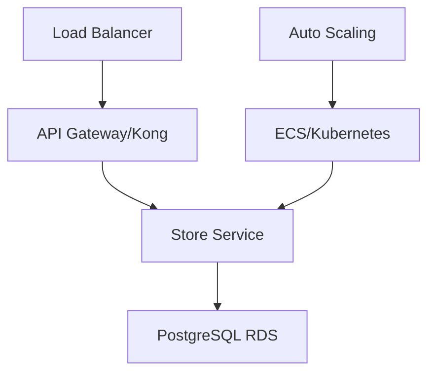

# Microservice Store

[](https://sonarcloud.io/summary/new_code?id=YOUR_SONAR_PROJECT_KEY)
[](https://sonarcloud.io/summary/new_code?id=YOUR_SONAR_PROJECT_KEY)

## 📋 Visão Geral

Microserviço responsável pela **gestão de lojas/estabelecimentos** construído com **Clean Architecture** e **NestJS**. Este serviço faz parte da arquitetura de microserviços do Tech Challenge e gerencia toda a lógica de domínio relacionada a operações, configurações e gerenciamento de lojas.

## 🚀 Funcionalidades

### 🏪 Gestão de Lojas

- Cadastro e autenticação de lojas
- Gestão de perfil de lojas
- Configuração de horário de funcionamento
- Informações de localização e contato
- Suporte a múltiplas lojas

### ⚙️ Configuração de Lojas

- Configurações operacionais
- Personalização de regras de negócio
- Feature toggles
- Configurações regionais

### 📊 Análises de Lojas

- Métricas operacionais
- Rastreamento de desempenho
- Monitoramento de status de lojas

## 📊 Métricas de Qualidade

- **Cobertura**: 93.87% (90 testes)
- **Qualidade**: Integrado com SonarCloud
- **CI/CD**: Pipeline automatizado com GitHub Actions
- **Arquitetura**: Clean Architecture com domínios isolados

## 🏗️ Arquitetura

### Stack Tecnológico

- **Framework**: NestJS 10.x com TypeScript 5.9.3
- **Arquitetura**: Clean Architecture (Hexagonal)
- **Banco de Dados**: PostgreSQL com TypeORM
- **Container**: Docker
- **Orquestração**: AWS ECS / Terraform
- **Testes**: Jest (93.87% de cobertura)
- **Qualidade de Código**: SonarCloud + ESLint
- **CI/CD**: GitHub Actions
- **API Gateway**: Kong Gateway (infraestrutura separada)

### Diagrama de Arquitetura



**Componentes de Infraestrutura:**

- **Orquestração de Containers**: AWS ECS com Fargate
- **Banco de Dados**: PostgreSQL (RDS)
- **Auto Scaling**: Baseado em CPU/Memória
- **Load Balancer**: Application Load Balancer (ALB)
- **API Gateway**: Kong Gateway para roteamento
- **CI/CD**: GitHub Actions com deployment automatizado
- **Monitoramento**: SonarCloud + CloudWatch

### Separação de Domínios

#### 🏪 Domínio de Lojas

- Gestão de entidades de lojas
- Autenticação e autorização
- Gestão de configuração
- Atualizações de perfil
- Suporte a multi-tenancy

## 📚 Documentação da API

### 🏥 Endpoint de Saúde

```http
GET /health                     # Verificação de saúde
```

### 🏪 Endpoints de Lojas

```http
POST   /stores                  # Registrar nova loja
GET    /stores                  # Listar todas as lojas
GET    /stores/:id              # Buscar loja por ID
PUT    /stores/:id              # Atualizar loja
DELETE /stores/:id              # Deletar loja
POST   /stores/login            # Autenticação de loja
```

**Exemplo de Requisição (POST /stores)**:

```json
{
  "name": "My Restaurant",
  "cnpj": "12345678000190",
  "email": "contact@myrestaurant.com",
  "phone": "1199999999",
  "address": {
    "street": "Main St",
    "number": "123",
    "city": "São Paulo",
    "state": "SP",
    "zipCode": "01234567"
  }
}
```

### ⚙️ Endpoints de Configuração

```http
GET    /stores/:id/config       # Buscar configuração da loja
PUT    /stores/:id/config       # Atualizar configuração
```

### 📊 Endpoints de Análises

```http
GET    /stores/:id/metrics      # Buscar métricas da loja
GET    /stores/:id/status       # Buscar status operacional
```

### 🔐 Autenticação

Endpoints de lojas requerem autenticação via:

- **Token JWT**: Após login bem-sucedido
- **Chave de API**: Para comunicação serviço a serviço

## 🚀 Primeiros Passos

### Pré-requisitos

- **Node.js** 20-22
- **Docker** e **Docker Compose**
- **PostgreSQL** 14+

### Desenvolvimento Local

#### 1. Configuração do Ambiente

```bash
# Navegar para a pasta app
cd microservice-store/app

# Instalar dependências
npm install

# Configurar variáveis de ambiente
cp env-example .env
```

**Principais Variáveis de Ambiente**:

```bash
# Aplicação
NODE_ENV=development
PORT=3000

# Banco de Dados
DB_HOST=localhost
DB_PORT=5432
DB_USER=postgres
DB_PASSWORD=postgres
DB_NAME=store

# JWT
JWT_SECRET=your-secret-key
JWT_EXPIRATION=3600

# AWS (para produção)
AWS_REGION=us-east-1
```

#### 2. Iniciar Serviços

```bash
# Iniciar banco de dados
docker-compose up -d

# Iniciar aplicação
npm run start:dev
```

#### 3. Acesso à Aplicação

- **API**: [http://localhost:3000](http://localhost:3000)
- **Health Check**: [http://localhost:3000/health](http://localhost:3000/health)

## 🛠️ Comandos de Desenvolvimento

### Instalação

```bash
npm install
```

### Execução

```bash
# Desenvolvimento com hot-reload
npm run start:dev

# Modo debug
npm run start:debug

# Produção
npm run build && npm run start:prod
```

### Testes

```bash
# Testes unitários
npm test

# Testes com cobertura
npm run test:cov

# Testes em modo watch
npm run test:watch
```

### Qualidade de Código

```bash
# ESLint
npm run lint

# Formatação de código
npm run format
```

## 🏗️ Estrutura de Clean Architecture

```
app/src/
├── common/                    # Elementos compartilhados
│   ├── DTOs/                 # DTOs comuns
│   ├── dataSource/           # Interfaces de acesso a dados
│   └── exceptions/           # Exceções customizadas
├── core/                     # 🎯 CAMADAS DE DOMÍNIO E APLICAÇÃO
│   ├── domain/              # Entidades de negócio
│   │   └── store/          # Entidade e repositório de loja
│   └── application/         # Casos de uso
│       └── store/          # Casos de uso de lojas
└── external/                # 🌐 CAMADA DE INFRAESTRUTURA
    ├── controllers/         # Controllers NestJS
    ├── database/           # Repositórios TypeORM
    └── services/           # Serviços externos
```

### Princípios Aplicados

- **🔄 Inversão de Dependência**: Core não depende de detalhes externos
- **🧪 Testabilidade**: Regras de negócio isoladas e testáveis
- **🔌 Independência de Framework**: Lógica de negócio desacoplada do NestJS
- **📱 Independência de UI**: API pode ser consumida por qualquer interface
- **🗄️ Independência de Banco de Dados**: Padrão Repository para persistência

## 🧪 Testes

### Cobertura de Testes

- **Cobertura Total**: 93.87%
- **Total de Testes**: 90 (todos passando)
- **Foco de Domínio**: Domínio de lojas apenas

**Tipos de Teste:**

- ✅ Testes Unitários: Entidades, casos de uso e serviços
- ✅ Testes de Integração: Controllers e repositórios
- ✅ Dependências Mockadas: Serviços externos e banco de dados

## 🔄 Pipeline de CI/CD

### Workflows do GitHub Actions

#### 1. Workflow de CI (.github/workflows/ci.yml)

**Gatilhos**:

- Pull requests para `main` e `development`
- Push para `main` e `development`

**Jobs**:

1. **test**: Executa todos os testes com cobertura
2. **sonarqube**: Análise de qualidade (needs: test)

**Funcionalidades**:

- ✅ Node.js 20.x
- ✅ Testes automatizados
- ✅ Relatório de cobertura (limite de 80%)
- ✅ Integração com SonarCloud
- ✅ Validação ESLint

#### 2. Workflow de Deploy (.github/workflows/deploy.yml)

**Gatilhos**:

- Push para `main` (após CI passar)
- Despacho manual

**Funcionalidades**:

- ✅ Build de imagem Docker
- ✅ Push para Amazon ECR
- ✅ Deploy no AWS ECS
- ✅ Validação de health check

## ☸️ Deploy

### Infraestrutura Terraform

O microserviço possui infraestrutura como código com Terraform:

```bash
cd infra

# Inicializar Terraform
terraform init

# Planejar deploy
terraform plan

# Aplicar infraestrutura
terraform apply
```

**Componentes Criados**:

- Task Definition e Service do ECS
- Instância PostgreSQL RDS
- Security Groups
- IAM Roles
- CloudWatch Logs

Para mais detalhes veja [infra/README.md](./infra/README.md)

## 📊 Monitoramento e Observabilidade

### SonarCloud

- **Organização**: fiap-tech-challange
- **Quality Gate**: Cobertura > 80%, Sem bugs, Sem vulnerabilidades

### CloudWatch (AWS)

- **Logs**: Logs de tarefas do ECS
- **Métricas**: CPU, Memória, Contagem de requisições
- **Alarmes**: Gatilhos de auto-scaling

## 🔗 Repositórios Relacionados

- **API Gateway**: [infra-gw-terraform](../infra-gw-terraform/)
- **Serviço Customer-Payment**: [microservice-customer](../microservice-customer/)
- **Serviço de Produtos**: [microservice-products](../microservice-products/)
- **Serviço de Notificações**: [microservice-notification](../microservice-notification/)
